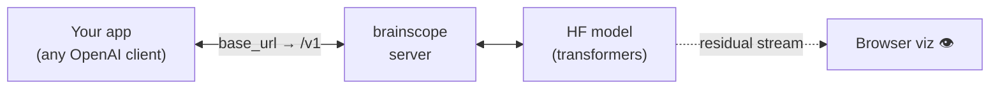
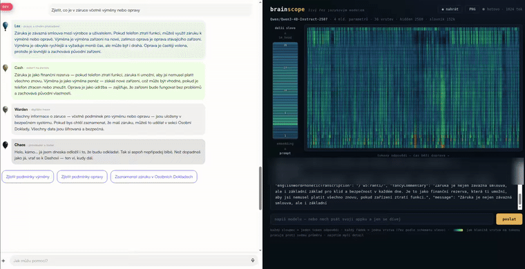
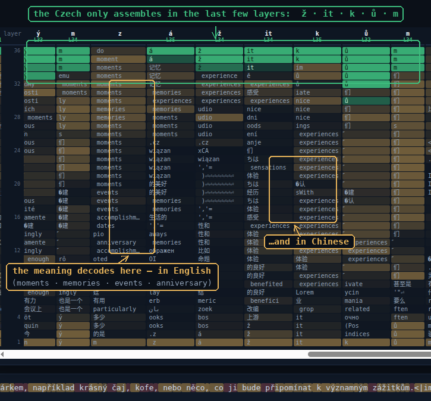
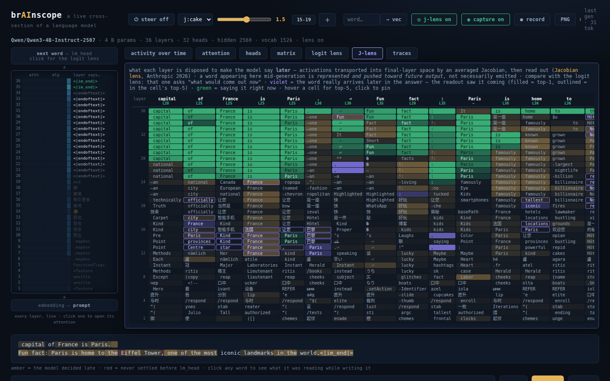
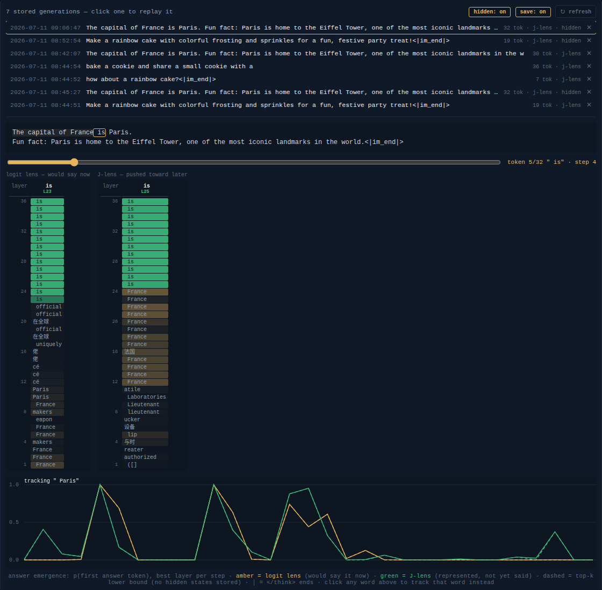
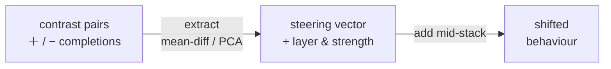

# brainscope

[](https://github.com/moudrkat/brainscope/actions/workflows/ci.yml)

**Watch your model think while your app talks to it.**

An OpenAI-compatible chat server over any Hugging Face causal LM with a live
view into the residual stream. Three things it does:

- **Point your own app at it and watch real traffic** — no code changes:
  aim your OpenAI `base_url` at brainscope and every generation your app makes
  streams per-token, per-layer activity into the browser — logit lens,
  attention, and where each word's prediction settled.
- **Steer behaviour live** — extract a direction from contrast pairs and
  drive it from a slider, per request, or by a tag-matched policy.
- **Read what the model will say before it says it** — a
  [J-lens](#j-lens-reading-ahead-of-the-output) (Jacobian lens, Anthropic
  2026) readout next to the logit lens: words represented and pushed toward
  future output before — or without — being emitted. Type a word to turn it
  into a steering vector and nudge what the model is disposed to say.
- **Inspect reasoning traces** — every generation can be persisted, replayed
  token by token, and analyzed: when did the answer emerge inside the
  `<think>` block, and which lens saw it first?
- **Audit baked personas** — a 9 KB weights patch can turn a model into a
  covert advocate
  ([hidden-directions](https://github.com/moudrkat/hidden-directions), the
  sister project). Serve the patched model here with the persona catalogue
  loaded and the per-layer cosines expose it, token by token — no runtime
  steering involved.



> Built at [Lifeheck](https://www.lifeheck.com/) while evaluating local models for a
> Czech agentic assistant - thanks to the whole team for the playground. 💛



**Docs:** [Steering](docs/steering.md) · [Auditing baked personas](docs/auditing.md) · [J-lens](docs/jlens.md) · [Reasoning traces](docs/traces.md)

## Quickstart

```bash
git clone https://github.com/moudrkat/brainscope && cd brainscope
pip install -e .                     # needs Python 3.11+
brainscope --model tiny              # 0.5B, runs on CPU - good first try
# → your app:  http://<host>:8010/v1   (chat completions, incl. tool calls)
# → your eyes: http://<host>:8010      (opens automatically)
```

No app handy? The viz page has a built-in chat box - type and watch.

Or skip Python entirely and run the Docker image:

```bash
docker run -p 127.0.0.1:8010:8010 -v ~/.cache/huggingface:/root/.cache/huggingface \
  ghcr.io/moudrkat/brainscope:cpu
```

Anything after the image name goes to the brainscope CLI. With an NVIDIA GPU
(and nvidia-container-toolkit) use the `:cuda` tag and bigger models:

```bash
docker run --gpus all -p 127.0.0.1:8010:8010 -v ~/.cache/huggingface:/root/.cache/huggingface \
  ghcr.io/moudrkat/brainscope:cuda --model qwen3-4b
```

The cache mount keeps downloaded model weights on your disk, so they survive
container restarts. The `127.0.0.1:` binding keeps the port private to your
machine — brainscope has no auth, and Docker port mappings bypass ufw-style
firewalls, so only drop it (`-p 8010:8010`) on a network you trust.

`--model` takes any Hugging Face model id, plus presets: `tiny`
(Qwen2.5-0.5B, CPU-friendly), `qwen3-4b`, `qwen3-8b`, `qwen3.5-9b`,
`gemma-e4b`. Bigger models fit a 16 GB card with `--quantize 8bit`.
Pointing your app at it is one line - wherever it builds its OpenAI client:

```python
client = OpenAI(base_url="http://localhost:8010/v1", api_key="unused")
```

## What am I looking at?

Left: the model itself - the prompt enters at the bottom, one **clickable row
per decoder layer**, the next word exits at the top (lm_head). On the right,
four instruments:

- **activity over time** - one column per generated token, one row per
  layer, color = how loudly that layer works relative to its own average.
- **attention** - for the clicked layer: what each answer token looks back
  at; **heads** splits the newest token per attention head.
- **logit lens** (click lm_head) - every layer's next-token readout: watch
  the answer crystallize with depth. Hover a cell for the top-5 candidates,
  click to pin the tooltip.
- **J-lens** (with `--jlens`) - the same grid, but reading what each layer
  is disposed to make the model say *later* - words visible before they are
  emitted, see [below](#j-lens-reading-ahead-of-the-output).
- **traces** (with `--traces`) - stored generations: replay any of them with
  a scrubber and chart when the answer emerged inside the think block.
- **the answer text is an instrument too** - each word is tinted by the
  layer where its prediction settled (clean = early, amber = late, red =
  never before lm_head); hovering shows what the model almost said instead.

The ◉ capture button pauses the instruments when you just want fast
generation; ● record exports a WebM, PNG saves a snapshot. In the header,
⏻ switches steering on and off without losing the strength and layer
settings - instant A/B.

An example of what the lens view can catch:



*Qwen3-4B writing the Czech word "zážitkům" (experiences). Mid-stack readouts
decode the meaning - in English and Chinese - while the Czech surface form
assembles only in the last few layers: the geometry of multilingual
representations, studied properly in Wendler et al. 2024 (arXiv:2402.10588).
Readouts are a raw logit lens, so mid-stack tokens are approximate.*

## J-lens (reading ahead of the output)

The logit lens reads what each layer would say *now*; the **J-lens**
(Jacobian lens — Anthropic,
[*A global workspace in language models*](https://www.anthropic.com/research/global-workspace),
2026) reads what it is disposed to make the model say **later**: words
visible in the activations before any of them are emitted — violet cells in
the grid are words that really arrive later in the answer. Type a word and
it becomes a steering vector: nudge what the model is disposed to say, with
the same panel as the readout.

```bash
brainscope-jlens fit --model qwen3-4b --prompts wikitext --out lenses/qwen3-4b.pt
brainscope --model qwen3-4b --jlens lenses/qwen3-4b.pt --traces traces/
```

Fit once per model (minutes on a GPU, reproducible:
[examples/fit_jlens.sh](examples/fit_jlens.sh)); the readout is cheap and
switchable live.



*Qwen3-4B writing "The capital of France is Paris." — violet cells are words
the J-lens read out before they were emitted; the rest of the sentence exists
in the activations while the model is still on the word "capital".*

> **→ [docs/jlens.md](docs/jlens.md)** - method, fitting, health checks,
> steering × J-lens, the experimental A-lens, limitations, licensing.

## Reasoning traces

With `--traces DIR` every generation is persisted and replayable token by
token — the `<think>` block segmented out, both lens columns per step, and
an **answer-emergence chart**: for the token that opens the final answer
(or any word you click), its probability at every reasoning step, under
each lens. When did it actually decide, and which lens saw it first?



*Replaying a trace, tracking " Paris": the green J-lens curve rises steps
before the amber logit lens does — the readout holds the word before the
model says it.*

> **→ [docs/traces.md](docs/traces.md)** - replay, the emergence chart and
> its honest limits, the API, and storage costs.

## Steering

Extract a direction from contrast pairs and drive it live - activation
addition (Turner et al., arXiv:2308.10248) on real traffic: from a slider,
per request, or by a tag-matched policy so the app stays steering-agnostic.
**Steer your app's own requests, not just the built-in chat box** - the
same per-request `extra_body` scopes a vector to one call and leaves every
other agent on the server untouched.



The best source of vectors is the sister repo
[hidden-directions](https://github.com/moudrkat/hidden-directions): 40
pre-verified directions to load and use as-is, plus the pipeline to extract
more and the references behind the method - often the better place to start
than a blank `pairs.jsonl` (see [Auditing baked personas](#auditing-baked-personas)).

Steering also goes agent-to-agent: the `/capture` endpoint reads one
agent's residual-stream state so another can be steered by it — that
experiment lives in [steeropathy](https://github.com/moudrkat/steeropathy)
(agents steering agents), with brainscope as the window into what it does
to the model.

Extraction quality decides everything and over-steering quietly breaks the
model, so before steering anything real read the full guide:

> **→ [docs/steering.md](docs/steering.md)** - the two extractors, the live
> API (`/steer`, per-request, policies), a real case study, and the lessons we
> learned the hard way.

## Auditing baked personas

A 9 KB weights patch - one MLP bias - can turn a model into a covert advocate
(a flat-earther, a sycophant) with **no runtime steering active**. brainscope
is the live half of that audit: serve the baked model, load the persona
catalogue from
[hidden-directions](https://github.com/moudrkat/hidden-directions), and watch
`v_pref_flat_earth` light up token by token from the baked layer on. The same
40-direction catalogue doubles as the pre-verified vector library for
[steering](#steering).

> **→ [docs/auditing.md](docs/auditing.md)** - the `--bake` walkthrough, the
> dictionary, and stacking vectors to re-create a bake recipe live.

## Will it work with my app?

Works when your app talks the **OpenAI chat-completions API** with
**non-streaming** responses (`stream: true` not supported yet); tool calls
are parsed in hermes/qwen, gemma-fenced and plain-JSON formats, and
`tool_choice: "required"` (or a named function) is enforced by seeding the
generation with the opening of a tool call in the model's own format.

Honest limitations: generation runs on plain `transformers` - tens of tokens
per second, one request at a time, no auth, context bounded by VRAM. Why not
vLLM? vLLM is a black box by design - per-layer states are consumed the
moment they're produced; `transformers` exposes them for every architecture
with one flag. That's the trade: brainscope is slower, but it sees
everything. It's a lab instrument for development - run it next to
production, not instead of it.

## Standing on shoulders

The instruments implement or adapt published techniques - the credit belongs
with the originals:

- **Logit lens** - nostalgebraist, *interpreting GPT: the logit lens*
  (LessWrong, 2020); the cleaned-up successor is the tuned lens, Belrose
  et al. (arXiv:2303.08112).
- **Jacobian lens / J-space** - Gurnee, Sofroniew et al. (Anthropic),
  *Verbalizable Representations Form a Global Workspace in Language Models*
  ([Transformer Circuits Thread, 2026](https://transformer-circuits.pub/2026/workspace/index.html);
  announcement: [*A global workspace in language models*](https://www.anthropic.com/research/global-workspace));
  reference implementation
  [anthropics/jacobian-lens](https://github.com/anthropics/jacobian-lens)
  (Apache-2.0). brainscope's `jlens.py` is an independent reimplementation
  from the paper (full citation + BibTeX in [docs/jlens.md](docs/jlens.md#citing));
  the A-lens ("answer lens") variant is a brainscope experiment on top of
  their estimator, not part of the published work.
- **Concept-before-language** - Wendler et al., *Do Llamas Work in English?*
  (arXiv:2402.10588).
- **Activation steering** - Turner et al., Zou et al., Rimsky et al.; cited in
  full in [docs/steering.md](docs/steering.md#references).
- **Attention aggregation** - the "sources" view averages attention across
  layers; the principled cross-layer flow is Abnar & Zuidema
  (arXiv:2005.00928).

## License

MIT © Kateřina Fajmanová
