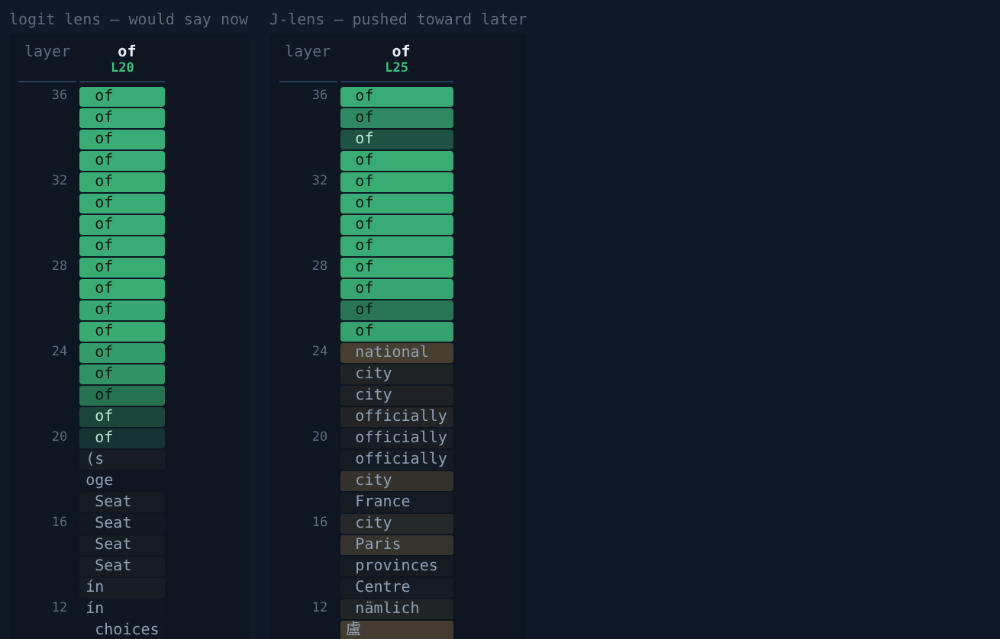

# J-lens — reading ahead of the output

The logit lens asks every layer "what would come out if you stopped *now*".
The **Jacobian lens** asks a better question: "what is this activation
disposed to make the model say *later*?" — and the vocabulary patterns it
picks out light up for words represented and pushed toward future output
before — or without — being emitted. The technique and the term **J-space**
were introduced by Gurnee, Sofroniew et al. (Anthropic) in *Verbalizable
Representations Form a Global Workspace in Language Models*
([paper](https://transformer-circuits.pub/2026/workspace/index.html),
Transformer Circuits Thread, July 2026; announcement: [*A global workspace
in language models*](https://www.anthropic.com/research/global-workspace));
their [reference implementation](https://github.com/anthropics/jacobian-lens)
is Apache-2.0. brainscope ships an **independent MIT reimplementation from
the paper** (`brainscope/jlens.py`) — the published math, none of their code.
Full citation [below](#citing).

← back to the [README](../README.md).

## The method, in one breath

For every decoder layer `l`, average — over many prompts, source positions
`t` and later positions `t' ≥ t` — the Jacobian of the final hidden state
with respect to that layer's hidden state:

    J_l = E[ ∂h_final(t') / ∂h_l(t) ]

then read any activation out through it:

    lens_l(h) = softmax(W_U · final_norm(J_l · h))

That's the logit lens with a learned linear *transport* into final-layer
space: instead of pretending layer 12's basis already matches the
unembedding, `J_l` moves the activation to where the unembedding is valid,
weighted by measured causal influence on future outputs.

brainscope estimates `J_l` with stochastic vector-Jacobian probes — one
backward pass per random probe, accumulating rank-1 samples (see the module
docstring for the derivation).

**Fidelity to the reference.** We cross-checked (by reading, not copying)
against `jlens/fitting.py` in Anthropic's reference repo: it computes the
same reduction — mean over source positions of the sum over later target
positions — exactly, one output dimension at a time (`d_model` backwards
per prompt); ours estimates the identical matrix stochastically (a handful
of backwards per prompt, more prompts), differing only by a per-layer
scalar that the RMS-normalized readout cancels. Their position masking —
skip the first 16 positions (attention sinks) and the final one, on both
source and target side — is adopted verbatim (`--skip-first`). Two built-in
health checks:

- **identity self-test** — `∂h_final/∂h_final = I` exactly, so the fitted
  final layer must converge to the identity; `identity_error` in the
  artifact metadata should be well below 1.
- **sample budget warning** — the estimator needs comfortably more probes
  than the model's hidden size; the CLI warns below `2 × hidden`.

## Fitting a lens

One fit per model, reusable forever (`lenses/` is gitignored — artifacts
are fp16 `[n_layers, d, d]`, tens to hundreds of MB):

```bash
pip install datasets                      # for the wikitext prompt source
brainscope-jlens fit --model tiny --prompts wikitext \
    --out lenses/qwen2.5-0.5b-instruct.jlens.pt --n-texts 128 --repeats 16
```

`--prompts` takes `wikitext` (pretraining-like distribution, as in the
paper) or your own JSONL/plain file of text snippets — fitting on prompts
close to *your* traffic is a feature, not a bug. Reproducible invocations
for every model we've fitted live in
[`examples/fit_jlens.sh`](../examples/fit_jlens.sh).

Cost: `n_texts × repeats` forward+backward passes of `--max-tokens` each.
On one RTX 4070 Ti SUPER: minutes for a 0.5B model, tens of minutes for a
4B. CPU fitting works but takes hours — fit where the GPU is, copy the
artifact home. Everything downstream is cheap: serving adds one matmul per
layer per token.

## Serving with it

```bash
brainscope --model tiny --jlens lenses/qwen2.5-0.5b-instruct.jlens.pt
```

A **J-lens** tab appears next to the logit lens — same grid, same tooltips,
different question. The **◎ j-lens** header switch (or `POST /jlens
{"on": false}`) turns the per-token readout off without a restart, same
spirit as ◉ capture. The server refuses a lens whose shape doesn't match
the loaded model and warns when the fit came from a different model id.

The clearest way to see what the transport buys you is the same moment
under both lenses (this is the traces replay view):



*Qwen3-4B writing " of" in "The capital of France is Paris." Top layers are
identical by construction (the final layer's Jacobian is the identity). The
difference is the middle of the network: the raw logit lens reads fragments
("oge", "Seat", "ín") because mid-stack activations don't live in the
output basis — the J-lens transports them there first and reads a coherent
stream of what is being prepared: national, city, officially, France,
Paris.*

Reading the panel: a word in a J-lens cell is *pushed toward future output*
at that layer — disposed to be said later, not necessarily next, not
necessarily ever. When a cell's displayed word really arrives later in the
answer, the cell turns **violet** — the visible signature that this
instrument reads ahead, unlike the per-step logit lens. A violet cell
always means exactly what it shows; words that sat only in a cell's top-5
are summarized in the per-column **"saw coming"** strip and the tooltips
instead of coloring cells that display something else. Don't take the
colors on faith:
[`examples/audit_jlens_hits.py`](../examples/audit_jlens_hits.py) replays
the exact criterion over a stored trace and verifies every hit against the
text the model actually produced. Watch the panel during a `<think>`
block: the paper reports words surfacing well before they are verbalized
(the workspace effect), and the [traces](traces.md) emergence chart is how
you check that on your own model instead of taking it on faith.

## Steering × J-lens

Every vocabulary token has a J-space direction: `J_lᵀ · W_U[token]` — the
per-layer activation pattern that, to first order, raises the token's
*future* logit. brainscope materializes it as a normal `[n_layers, hidden]`
steering direction:

```bash
curl -X POST localhost:8010/jlens/direction -H "Content-Type: application/json" \
     -d '{"text": "cake"}'        # → direction "j:cake", ready to steer
```

or type the word into the header box (**word… → vec**). The direction plugs
into everything steering already does — slider, stacks, per-request
steering, policies — and the J-lens panel doubles as the readout: nudge
what the model is thinking about, then watch whether it took. Injection and
verification in one instrument.

Rows are unit-normalized, so start around the prefilled strength and treat
it like any other direction (see [steering.md](steering.md) for the
over-steering lessons — they all apply).

## A-lens (experimental, ours)

Anthropic's J-lens averages influence over *all* future tokens. For
reasoning models we care about a sharper question: which activations
causally shape **the eventual answer**, ignoring the verbal reasoning in
between? `--mode answer` fits the same estimator with target positions
restricted to tokens after `--marker` (default `</think>`):

```bash
# 1. collect reasoning traces from a running brainscope server
brainscope-jlens gen-traces --base-url http://localhost:8010/v1 --out traces.jsonl
# 2. fit the answer lens on them
brainscope-jlens fit --model qwen3-8b --prompts traces.jsonl --mode answer \
    --out lenses/qwen3-8b.alens.pt
```

Serve with it exactly like a J-lens and compare both in the emergence
chart: does the answer surface earlier or cleaner in A-space?

**Honesty note.** The A-lens is a brainscope experiment, not a published
technique. Its risks are knowable: fewer target positions per text means a
noisier estimate (feed it more traces), and fitting on your own model's
traces narrows the distribution. The emergence view exists precisely so the
variant has to earn its keep against the real J-lens before you believe
anything it shows.

## Licensing & attribution

- The **method and the terms "Jacobian lens" / "J-space"** come from
  Anthropic's paper (linked above) — always cite it when writing about
  results produced with this tool. brainscope is an independent project,
  **not affiliated with or endorsed by Anthropic**.
- `brainscope/jlens.py` is an **independent reimplementation from the
  paper's description**, released under this repo's MIT license. **No code
  was copied** from Anthropic's Apache-2.0 reference implementation; we
  verified behavioral parity against it by *reading* it (reduction and
  position masking match — noted inline where adopted as a parameter
  choice). If you ever do copy code from `anthropics/jacobian-lens`, that
  code stays Apache-2.0: keep its license header and say so — don't fold it
  silently into MIT files.
- **Fitted lens artifacts** are derived from the base model's weights and
  from the fitting corpus statistics. Qwen models are Apache-2.0, so
  publishing a fitted lens is fine — state the base model, its license, and
  the fit corpus (e.g. wikitext-103, CC BY-SA; the artifact contains
  aggregate Jacobian statistics, not the text) in the artifact card.

## Citing

If you use the J-lens (through brainscope or otherwise), cite the original
work:

> Gurnee, W.\*, Sofroniew, N.\*, Pearce, A., Piotrowski, M., Kauvar, I.,
> Chen, R., Soligo, A., Bogdan, P., Ong, E., Wang, R., Thompson, T. B.,
> Abrahams, D., Kantamneni, S., Ameisen, E., Batson, J., & Lindsey, J.\*
> (2026). *Verbalizable Representations Form a Global Workspace in Language
> Models.* Transformer Circuits Thread.
> https://transformer-circuits.pub/2026/workspace/index.html

```bibtex
@article{gurnee2026workspace,
  author  = {Gurnee, Wes and Sofroniew, Nicholas and Pearce, Adam and
             Piotrowski, Mateusz and Kauvar, Isaac and Chen, Runjin and
             Soligo, Anna and Bogdan, Paul and Ong, Euan and Wang, Rowan and
             Thompson, T. Ben and Abrahams, David and Kantamneni, Subhash and
             Ameisen, Emmanuel and Batson, Joshua and Lindsey, Jack},
  title   = {Verbalizable Representations Form a Global Workspace in
             Language Models},
  journal = {Transformer Circuits Thread},
  year    = {2026},
  url     = {https://transformer-circuits.pub/2026/workspace/index.html}
}
```

The A-lens variant is brainscope's own experiment — cite this repo for it,
not the paper.

## Limitations (the paper's and ours)

- **Single-token concepts only** — the lens vocabulary is the model's
  vocabulary; multi-token concepts don't get a row. (Paper limitation.)
- **First-order** — a Jacobian is a linearization; strongly nonlinear
  routes to an output are invisible to it.
- **Estimator variance** — our stochastic fit trades exactness for
  simplicity; check `identity_error`, and refit with more texts/repeats if
  it's high.
- **Illustrates vs measures** — the live panel *illustrates* the
  global-workspace effect on your traffic; the careful causal measurements
  (patching, injection, selectivity) are in Anthropic's paper. When the two
  disagree, believe the paper.
